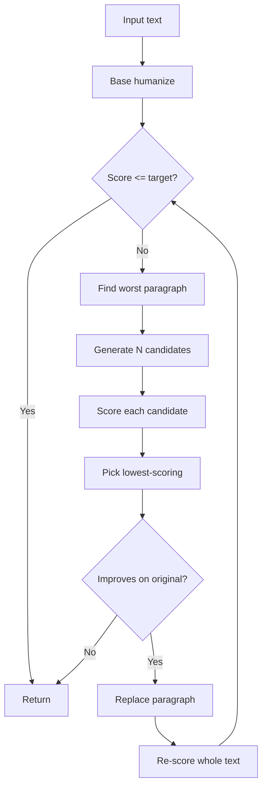

# HumanizeMCP Architecture

This document is for contributors and is the canonical complement to `research/06_implementation_recommendations.md`. The README is for users.

## 1. Top-level layout

```
humanize-mcp/
  server.py             FastMCP entry point and tool surface (this lane)
  pipelines/            The 9-pass pipeline implementations (Pipeline Builder)
    runner.py           Orchestrator: dispatched by server.humanize()
    tells.py            Tell detection: dispatched by server.detect_tells()
    pass_*.py           One module per pass (preprocess, surface_tells, ...)
  styles/               Style preset definitions (Pipeline Builder)
    registry.py         Enumerates available presets
    transfer.py         Pure register translation
    presets/            Per-preset YAML or JSON config
  benchmark/            Detector adapters and benchmark harness (Benchmark Engineer)
    detectors.py        score(text, detector="...") dispatcher
    adapters/           One module per detector
    smoke_test.py       Existing minimal sanity check
  research/             Evidence base and design rationale (frozen)
  docs/                 Contributor-facing prose (this file, ETHICS.md)
  tests/                pytest suite
```

The three subpackages talk to `server.py` through narrow contracts described below. Anything outside these contracts is internal.

## 2. The pipeline pass order

The pipeline runs left to right. Each pass can be skipped per preset and per call; skip behavior should be deterministic and logged.

| # | Pass | Cost | Default in v0.1 | Notes |
|---|---|---|---|---|
| 1 | `preprocess` | µs | on | Unicode NFKC, zero-width strip, scaffolding strip |
| 2 | `surface_tells` | ms | on | The single highest-ROI pass; lexical and punctuation level |
| 3 | `watermark_scrub` | µs | on | Mostly subsumed by pass 1; defensive |
| 4 | `stylometric_smoothing` | tens of ms | on | Burstiness and perplexity targeting |
| 5 | `dipper_paraphrase` | seconds | off | Heavy; needs DIPPER weights |
| 6 | `detector_guided` | tens of seconds | off | The Cheng et al. 2025 loop |
| 7 | `back_translation` | seconds | off | NLLB or OPUS-MT roundtrip |
| 8 | `style_transfer` | seconds | conditional | Active iff a style corpus is supplied |
| 9 | `verify` | ms-seconds | on | Re-score and report |

The MVP (v0.1) enables passes 1-4 and 9, which is enough to defeat GPTZero and ZeroGPT for typical inputs. Passes 5-8 are the v0.2-v0.4 milestones; see `research/06_implementation_recommendations.md` section 9.

### Pass interface contract

Every pass implements:

```python
def run(text: str, ctx: PassContext) -> PassResult:
    """Apply this pass to text and return the transformed string plus a record."""
```

Where `PassContext` carries the active preset, intensity, preserve list, and accumulated detector scores; `PassResult` carries the transformed text plus a structured diff (what was added, removed, substituted, with character offsets) for the verification pass to fold into the final report.

Passes must be:

- **Idempotent on already-clean input.** Applying pass 2 to text that has no surface tells must return the input unchanged.
- **Semantic-preserving.** Pass 4-8 must keep `sentence-transformers` cosine similarity above 0.9 against the input; pass 6 verifies this and rolls back candidates that fail.
- **Deterministic when possible.** Pass 1-4 are deterministic given fixed inputs. Pass 5-8 use sampling and are seeded.

## 3. Style preset schema

Style presets are JSON or YAML files in `styles/presets/`. The schema is informally:

```yaml
name: esl
description: |
  Multi-line description of who this preset is for and why each setting
  has the value it does. This text is shown by list_styles() in verbose
  mode.
passes:
  preprocess: enabled
  surface_tells:
    enabled: true
    em_dash_substitution: aggressive    # off | minimal | balanced | aggressive
    excess_vocabulary: aggressive
    discourse_markers: minimal
    parallel_structure: minimal
    copular_templates: disabled
  watermark_scrubber: enabled
  stylometric_smoothing:
    enabled: true
    burstiness_target: 0.6              # target sentence-length variance
    perplexity_target: 8.0              # target reference-LM perplexity
    operate_on: paragraph_only
  dipper:
    enabled: false
  detector_guided:
    enabled: true
    intensity: balanced
    paraphraser_instruction: |
      Rewrite the following to sound like a confident, well-educated
      non-native English speaker.
  back_translation: disabled
  style_transfer: enabled_if_corpus_supplied
preserve_features:
  - lexical_diversity_floor: 0.4
  - discourse_marker_floor: 0.7
  - sentence_length_mean: tolerance(0.15)
```

A new preset should:

1. Be motivated by a population study cited in `research/03_human_diversity.md` or by a documented use case.
2. Default conservatively (passes off, intensity minimal) until empirical testing justifies more aggressive settings.
3. Include unit tests asserting that the preserve_features survive pipeline execution within tolerance.

## 4. Detector adapter contract

Adapters live in `benchmark/adapters/` and conform to:

```python
class DetectorAdapter(Protocol):
    name: str
    requires_api_key: bool
    cost_per_call: float | None     # USD if commercial, None if local

    def score(self, text: str) -> dict:
        """Return a dict matching the DetectorScore Pydantic model.

        Keys: detector, probability_ai, confidence, error.
        """
```

Adapters shipping in v0.1:

| Adapter | Source | Cost | Notes |
|---|---|---|---|
| `roberta-base` | `openai-community/roberta-base-openai-detector` | local | Canonical academic baseline |
| `fast_detect_gpt` | upstream Bao et al. impl | local | Needs gpt-neo-2.7b + gpt-j-6b |
| `binoculars` | upstream Hans et al. impl | local | Needs falcon-7b pair |
| `stylometric_xgboost` | trained on HC3 | local | Tiny, fast, interpretable |

Optional, user-key adapters (v0.3+): `gptzero`, `originality_ai`, `sapling`, `copyleaks`. These require the user to set environment variables documented in `docs/DETECTORS.md` (to be added).

## 5. The benchmark loop

The benchmark harness in `benchmark/run.py` implements the standard evaluation loop:

```
for sample in dataset:
    pre = score(sample.text, all_detectors)
    rewritten = humanize(sample.text, style=preset)
    post = score(rewritten, all_detectors)
    record(sample.id, preset, pre, post, rewritten)
report = aggregate(records)
```

Datasets supported in v0.1: a small RAID subset and HC3-English. Both are downloaded lazily and cached under the user's HF cache.

The benchmark records semantic similarity (sentence-transformers MPNet) alongside detector scores so we can flag any pipeline change that drops similarity below 0.9 even if detector scores improve.

## 6. Extension points

### Add a new pipeline pass

1. Create `pipelines/pass_<name>.py` exposing `run(text, ctx) -> PassResult`.
2. Register it in `pipelines/runner.py` in the canonical order (see section 2).
3. Add per-preset enable defaults to each preset YAML.
4. Add unit tests in `tests/pipelines/test_pass_<name>.py` asserting idempotency and semantic preservation.
5. Document in this file, in `research/06_implementation_recommendations.md` if the pass is novel, and in the README pass table.

### Add a new detector

1. Create `benchmark/adapters/<name>.py` implementing the DetectorAdapter protocol.
2. Register it in `benchmark/detectors.py` so `score(text, detector="<name>")` dispatches to it.
3. Add the `<name>` row to the README detector table and to `docs/DETECTORS.md`.
4. Add a fixture-based test that the adapter classifies `benchmark/smoke_test.py`'s SAMPLE_CLAUDE as AI and SAMPLE_HUMAN as human.

### Add a new style preset

1. Create `styles/presets/<name>.yaml`.
2. The registry auto-discovers files in this directory; no code change needed.
3. Add the preset row to the README style preset table.
4. Add a regression test asserting the preset's `preserve_features` are honored.

## 7. Observability

The pipeline emits structured records consumed by `humanize_and_verify` and `humanize_dry_run` (planned). Every pass writes a `PassRecord` containing:

- Pass name and version
- Wall-clock duration
- Input length and output length
- Edits applied (substitutions, splits, merges, deletions) with character offsets
- Per-pass detector score deltas where applicable
- Warnings (e.g. "semantic similarity dropped below 0.92")

These records bubble up into the final `VerifyResult` so users can see exactly what the pipeline did. Trust requires legibility.

## 8. Performance targets

The MVP (passes 1-4) should run end-to-end on a 500-word input in under 200ms on a 2024-era laptop CPU. The full pipeline (passes 1-9 with DIPPER and detector-guided iteration) is expected to take 30-90 seconds per 500-word input on a single consumer GPU; the README documents this and the verify-and-iterate loop is the user-facing surface for the slow path.

## 9. Concurrency model

FastMCP handles request multiplexing. Within a single `humanize` call, passes run sequentially (the next pass depends on the previous pass's output). Inside passes that batch over paragraphs, internal parallelism is allowed; the orchestrator does not parallelize across passes for the same input.

For long-running calls (full pipeline with paraphrase passes) the server uses FastMCP's `Context` to stream progress events back to the client.

## 10. Detector-guided iterative humanization (v0.2.0, Bet 3)

The `humanize_and_verify` MCP tool is no longer a thin wrapper over a deterministic ramp loop. As of v0.2.0 it dispatches to `pipelines.IterativeHumanizer`, which implements the Cheng et al. 2025 algorithm (see `research/04_humanization_techniques.md` section 1.3).

### Why the v0.1.x loop did not work

`docs/REVIEW_v0.1.0.md` section 2.9 documents the failure mode: the v0.1 loop ran the same deterministic 9-pass pipeline at progressively higher intensities (0.5, 0.7, 0.9). Every pass except 9-heavy is idempotent on its own output, so iterations 2-3 produced zero-change runs. The "verification" loop was, in practice, just `humanize()` plus extra latency.

A loop can only converge on a lower detector score if the candidate generator is *non-deterministic*. The Cheng et al. 2025 prescription is to generate N stochastic paraphrase candidates per iteration, score each, and keep the lowest. That is what `IterativeHumanizer` does.

### The algorithm



In words:

1. Run the base 9-pass pipeline at `aggressive` intensity. This handles all the surface tells (em dashes, lexical swaps, contractions, rhythm).
2. Score the result against the configured detector. If at or below `target_ai_score`, return.
3. Otherwise, score each paragraph individually. Pick the paragraph with the highest AI probability.
4. Ask `ParaphrasePass.paraphrase_candidates(text, n=N, seed=...)` for N stochastic variants of that paragraph.
5. Score each candidate. Keep the lowest-scoring one. If no candidate beats the original paragraph score, stop (further iteration is just noise).
6. Splice the winning candidate into the text in place of the worst paragraph. Re-score the whole text.
7. If the new whole-text score is at or below `target_ai_score`, return. Otherwise repeat from step 3, up to `max_iterations` times.

### Per-iteration cost budget

The orchestrator targets a soft 30-second budget per iteration on a 5-paragraph essay. Cost dominates in step 4 (heavy paraphrase) and step 5 (per-candidate detector scoring). When the budget is exceeded the loop logs a warning and continues; it does not abort, so the caller always gets a result.

### Detector targeting

`humanize_and_verify(target_detector="trusted_mean")` (the default) optimizes against the `BenchmarkSuite.trusted_mean_ai_probability` aggregate, which excludes detectors with documented bias caveats (see `benchmark/benchmark_suite.py`). `target_detector="raw_mean"` optimizes against the unweighted mean. Any other value is treated as a specific detector name (e.g. `"roberta_openai"`).

This is the lever that lets a downstream tool say "I want this to slip past Pangram specifically" rather than averaging across an ensemble that may push other scores up. Section 3.4 of `docs/REVIEW_v0.1.0.md` warned that ensembles can disagree; `target_detector` makes that tradeoff explicit.

### Graceful degradation

If `ParaphrasePass.paraphrase_candidates` is missing at runtime (e.g. a stub install where Bet 1 has not yet shipped), the iterative humanizer falls back to a single deterministic light paraphrase per iteration. The loop will then exit on its "no improvement" check rather than crash. The `notes` field of `IterativeResult` records the fallback so callers can see what happened.

If the `BenchmarkSuite` cannot be built (no detector backend installed), the loop returns the baseline humanization with `iterations=0` and a `notes` entry explaining the situation. The `humanize_and_verify` MCP tool layers a second fallback on top: if the iterative path raises for any reason, it falls back to the v0.1 deterministic ramp loop so the tool is never broken end to end.
